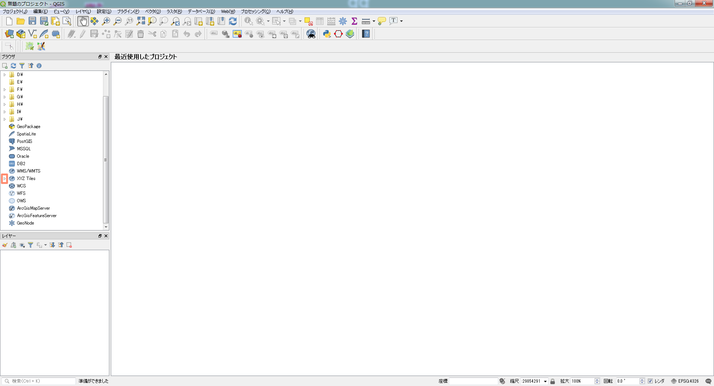
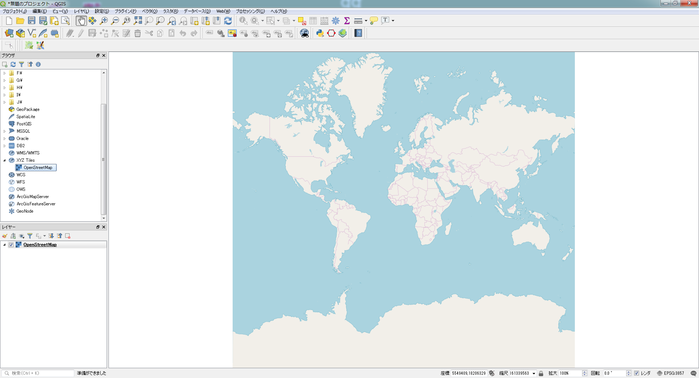
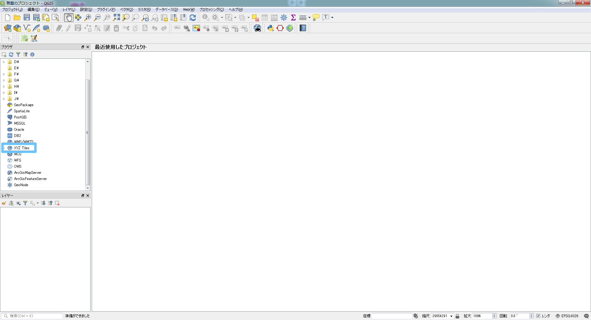
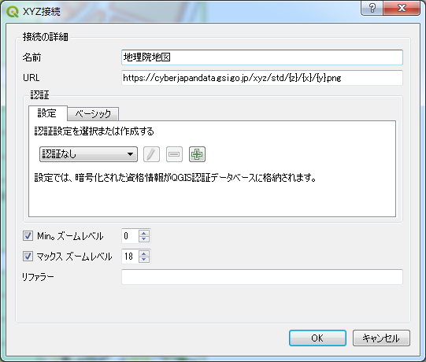
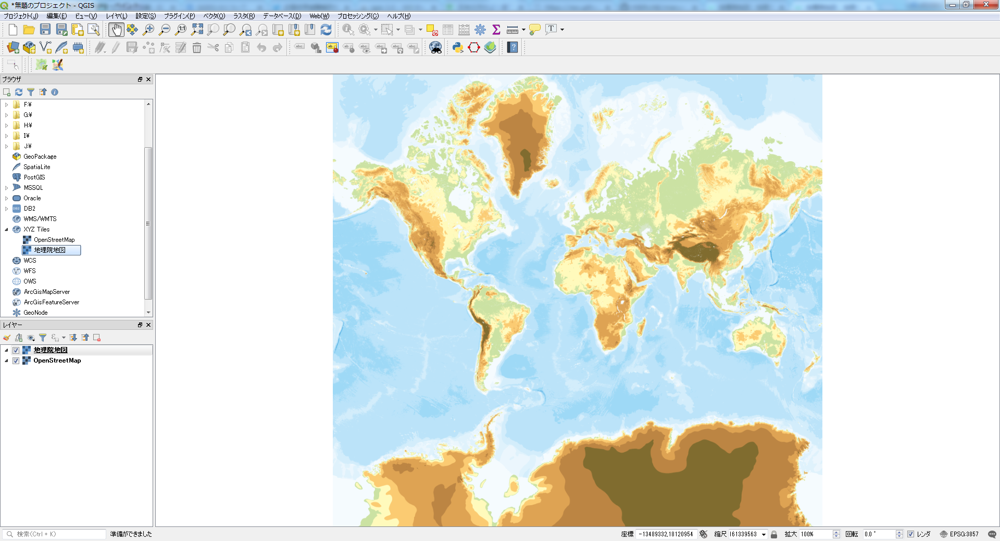

#第9章：公開されている地図を使用する

### 編集メモ：リード文
　オープンデータを使用して、目的に合わせて自分でスタイルを設定した地図を作成することができます。ただし、「どのデータを取得してくるか」「どういったスタイルを設定するか」といった表現作りのコツは必要になってきます。そこで本章では「オープンストリートマップ」「地理院地図」等を例に、すでに表現が付けられ状態で公開されている地図画像データを使用する方法について説明します。

### 9.1：公開されているTileMapを使用する
　QGISの3.x系へのメジャーバージョンアップに伴い、いくつかのPluginが2.x系のままでは使用不可能になってしまいました。一方で、XYZ Tilesが標準的に用いられるようになりましたので、Pluginを使用するよりも、標準の機能として備わっているTileMapを用いる方が自然であると言えるでしょう。
　ここでは、いくつかの公開されているTile Mapの使用方法を紹介したいと思います。

#### OpenStreetMapの場合
QGIS3.x系に於いてOpenStreetMapは予め使用可能になっています。

ブラウザパネル内の
- XYZ Tilesを右クリックしてください。


- XYZ Tilesの左横に小さな三角形のマークがあります。これをクリックしてください。


- OpenStreetMapが接続していることが、確認できるかと思います。これをクリックし、レイヤパネルを確認してください。

#### 1つのTile Mapをレイヤーとして追加する方法(地理院地図)
ブラウザパネル内の
- XYZ Tilesを右クリックしてください。


- 右クリック後、New Connectionをクリックしてください。下記画面が表示されます。


- 地理院地図を追加する


- 名前:地理院地図
- URL```https://cyberjapandata.gsi.go.jp/xyz/std/{z}/{x}/{y}.png```
と記入してください。

- 地理院地図を表示する



<strike>

- 図9-1：

- 図9-2：オープンストリートマップ

#### 9.1.1：OpenCycleMap
　QGISメニューから［Web］⇒［OpenLayersPlugin］⇒［OpenStreetMap］⇒［OpenCycleMap］を選択します。オープンストリートマップは有志が編集していますが、OpenCycleMapはその中でも特に自転車が好きな人たちの手で編集しているものです。そのため世界全体はカバーされていないので、ここでは編集が盛んなヨーロッパ地域にズームしてください（▼図9-3）。
　例えばOpenCycleMapの編集が盛んなオランダのマーストリヒト周辺は▼図9-4のようになっています。

- 図9-3：OpenCycleMap（ヨーロッパ地域）
- 図9-4：OpenCycleMap（オランダのマーストリヒト周辺）

#### 9.1.2：OCM Landscape
　QGISメニューから［Web］⇒［OpenLayersPlugin］⇒［OpenStreetMap］⇒［OCMLandscape］を選択します。OCM Landscapeは建物が加えられた地図です。OpenCycleMap同様に、世界全体をカバーしていません。▼図9-5は、神奈川県横浜市港北区日吉駅周辺を拡大したものです。

- 図9-5：OCM Landscape

#### 9.1.3：OCM Public Transport
　QGISメニューから［Web］⇒［OpenLayersPlugin］⇒［OpenStreetMap］⇒［OCMPublic Transport］を選択します。OCM Public Transportは公共交通機関が加えられた地図です。同様に、世界全体をカバーしていません。▼図9-6は、東京都港区三田周辺を拡大したものです。
　その他の地図サービスも選択できるので、いろいろ試してみてください。

- 図9-6：OCM Public Transport

### 9.2：地理院地図を使用する
　地理院地図を表示するために、タイル地図を表示してくれる「TileLayer Plugin」という追加機能を利用します（▼図9-7）。
　TileLayer Pluginをインストールすると、次のディレクトリにTileLayerPluginが置かれます。

#### 編集メモ：本文中リスト
C:¥Users¥[UserName]¥.qgis2¥python¥plugins¥TileLayerPlugin

　TileLayer Pluginのディレクトリは、▼図9-8のファイルで構成されています。

- 図9-7：TileLayer Pluginの追加

- 図9-8：タイルレイヤプラグインファイル

#### 9.2.1：設定ファイルを作成する
　使用したい地理院地図を指定したTSV形式（タブ区切り）の設定ファイルを作成する必要があります。TileLayerPluginディレクトリの中にあるlayersディレクトリ内に設定ファイル（tile.tsv）を追加してください。
　設定ファイル（tile.tsv）には、次の項目をタブで区切って記載します。設定例は▼リスト9-1のとおりです。

・タイトル
・クレジット
・URL
・Y軸の設定（1：下から、0：上から）
・ズームレベル最小値
・ズームレベル最大値
・経度最小値
・経度最大値
・緯度最小値
・緯度最大値

####リスト9-1：地理院地図の定義ファイル（tile.tsv）の例
▼編集メモ：見開き表示としてください。
#####国土地理院の地図タイルをQGISで利用するためのレイヤ定義ファイルの例

```
標準地図                     国土地理院  http://cyberjapandata.gsi.go.jp/xyz/std/{z}/{x}/{y}.png    1  2   18  122.78  20.4  154.78  45.58
電子国土基本図（オルソ画像） 国土地理院  http://cyberjapandata.gsi.go.jp/xyz/ort/{z}/{x}/{y}.jpg    1  15  17  122.78  20.4  154.78  45.58
白地図                       国土地理院  http://cyberjapandata.gsi.go.jp/xyz/blank/{z}/{x}/{y}.png  1  5   14  122.78  20.4  154.78  45.58
色別標高図                   国土地理院  http://cyberjapandata.gsi.go.jp/xyz/relief/{z}/{x}/{y}.png 1  5   15  122.78  20.4  154.78  45.58
```
　さらに他の地図を使用したい場合など設定ファイルに関しては、TileLayerPlugin作者が公開している次のサイトを参考にしてください。

- GitHub：minorua/GSIMaps.tsv
　▼URL▼https://gist.github.com/minorua/7654132

　また、地理院地図の利用規約や詳細な仕様に関しては国土地理院の公式ページを参照してください。

- 地理院地図 利用規約
　▼URL▼http://portal.cyberjapan.jp/help/termsofuse.html ★★★
- 地理院タイル一覧
　▼URL▼http://portal.cyberjapan.jp/help/development/ichiran.html ★★★
- 地理院地図 技術情報
　▼URL▼http://portal.cyberjapan.jp/help/development/ichiran.html ★★★

　利用に際しては、地理院タイル一覧から使用する地図の備考欄を参照して、基本測量成果であるかを確認しておくことは重要になります。そのうえで、測量成果の複製／使用にあたるかの判断が必要です。

####9.2.2：TileLayerPluginを起動する
　QGISメニューから［Web］⇒［タイルレイヤプラグイン］⇒［タイルレイヤを追加する］を選択すると、「タイルレイヤを追加する」ダイアログ（▼図9-9）が表示されます。
　使用したいtile地図を選択できます（▼図9-10～▼9-12）。

- 図9-9：タイルレイヤを追加するダイアログ

- 図9-10：標準地図

- 図9-11：白地図

- 図9-12：色別標高図
</strike>
#### 9.2.3：投影法を設定する
　OpenLayers Plugin/TileLayer Pluginを使用する場合は、投影法が「WGS 84 / PesudoMercator（EPGS:3857）」に自動的に設定されます。設定後に投影法を変更してしまった場合は、表示がされなくなってしまうので注意が必要です。
　表示されなくなった場合は、投影法を元に戻しましょう。
　レイヤパネルにあるレイヤ上で右クリック⇒［レイヤCRSを設定する］で空間参照システム選択ダイアログ（▼図9-13）が開くので、［空間参照システム］から「WGS 84 / PesudoMercator」を選択してください。選択されたCRSテキストボックス内が「空間参照システムWGS 84 / Pesudo Mercator」であることを確認して［OK］をクリックします。

- 図9-13：空間参照システム選択ダイアログ

