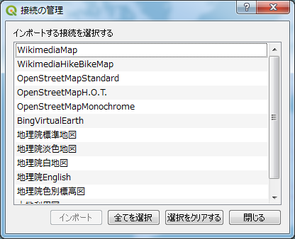

# 第9章：公開されている地図を使用する

### 編集メモ：リード文
　オープンデータを使用して、目的に合わせて自分でスタイルを設定した地図を作成することができます。ただし、「どのデータを取得してくるか」「どういったスタイルを設定するか」といった表現作りのコツは必要になってきます。そこで本章では「オープンストリートマップ」「地理院地図」等を例に、すでに表現が付けられ状態で公開されている地図画像データを使用する方法について説明します。

## 9.1：公開されているTileMapを使用する
　QGISの3.x系へのメジャーバージョンアップに伴い、2.x系の時に好評であったいくつかのPluginが使用不可能になってしまいました。第一版で取り上げていたOpenLayers Pluginもその一つです。一方で、3.x系になってからはXYZ Tilesが標準的に用いられるようになりましたので、Pluginを使用するよりも、標準の機能として備わっているTileMapを用いる方が自然であると言えるでしょう。そこで、この章では、公開されているTile Mapの使用方法をいくつか紹介したいと思います。

### 9.1.1 OpenStreetMapの場合
QGIS3.x系に於いてOpenStreetMapは予め使用可能になっています。

ブラウザパネル内の

- XYZ Tilesの左横に小さな三角形のマークがあります。これをクリックしてください。


- OpenStreetMapが接続していることが、確認できるかと思います。これをダブルクリックし、レイヤパネルを確認してください。


### 9.1.2 地理院地図をレイヤーとして追加する方法
ブラウザパネル内の
- XYZ Tilesを右クリックしてください。  


- 右クリック後、New Connectionをクリックしてください。
   

- 下記画面が表示されます。
  


- 地理院地図を追加する  

	- 名前:地理院地図
	- URL```https://cyberjapandata.gsi.go.jp/xyz/std/{z}/{x}/{y}.png```
と記入してください。


- 地理院地図を表示する


例えば、地理院地図の場合、下記URLにて使用可能な公開TileMap一覧を公開しています。
- https://maps.gsi.go.jp/development/ichiran.html#std

以降では、open street mapや地理院地図の他に、公開されているTileMapを使用する方法を記載します。

### 9.2.1　設定ファイルを作成し、公開されているTileMapを使用する
　TileMapへの接続の仕方はXMLの設定ファイルを作成する方法と、python scriptを用いる方法等があります。初めに、XMLの設定ファイルを使用する方法を紹介します。また、この方法を用いることで、複数のTileMapと接続を一度に行えます。保存する際は「.xml」として保存してください。

- XYXTileMap用XML書式SAMPLE
```
<!DOCTYPE connections>
    <qgsXYZTilesConnections version="1.0">
	[ここに使用したいTileMapの接続先を記載する]
	</qgsXYZTilesConnections>
```

- 接続先を記載する際には、下記のXMLTagに従い追記します。
```
<xyztiles username="" name="WikimediaMap" password="" authcfg="" zmin="1" referer="" url="https://maps.wikimedia.org/osm-intl/{z}/{x}/{y}.png" zmax="20"/>
```
usernameやpassword等は、有料のTileMapを使用する際に用いるものなので、今回は説明の範囲外とします。
- 「name」は9.1.2で参照した名前と同義です。レイヤを追加する際の名称として記載されます。
- 「zmin」はzoom levelの最小サイズになります。通例、公開元に指定があります。
- 「url」はname同様に9.1.2で参照したURLと同義です。追加したいTileMapの公開サーバーへのURLになります。
- 「zmax」はzoom levelの最大サイズになります。通例、公開元に指定があります。

以上を踏まえて、サンプルの定義ファイルを作成すると、下記のようになります。

- qgis3_tile_settings.xml
```
<!DOCTYPE connections>
    <qgsXYZTilesConnections version="1.0">
        <xyztiles username="" name="WikimediaMap" password="" authcfg="" zmin="1" referer="" url="https://maps.wikimedia.org/osm-intl/{z}/{x}/{y}.png" zmax="20"/>
        <xyztiles username="" name="WikimediaHikeBikeMap" password="" authcfg="" zmin="1" referer="" url="http://tiles.wmflabs.org/hikebike/{z}/{x}/{y}.png" zmax="17"/>
        <xyztiles username="" name="OpenStreetMapStandard" password="" authcfg="" zmin="0" referer="" url="http://tile.openstreetmap.org/{z}/{x}/{y}.png" zmax="19"/>
        <xyztiles username="" name="OpenStreetMapH.O.T." password="" authcfg="" zmin="0" referer="" url="http://tile.openstreetmap.fr/hot/{z}/{x}/{y}.png" zmax="19"/>
        <xyztiles username="" name="OpenStreetMapMonochrome" password="" authcfg="" zmin="0" referer="" url="http://tiles.wmflabs.org/bw-mapnik/{z}/{x}/{y}.png" zmax="19"/>
        <xyztiles username="" name="BingVirtualEarth" password="" authcfg="" zmin="1" referer="" url="http://ecn.t3.tiles.virtualearth.net/tiles/a{q}.jpeg?g=1" zmax="19"/>
        <xyztiles username="" name="地理院標準地図" password="" authcfg="" zmin="2" referer="" url="http://cyberjapandata.gsi.go.jp/xyz/std/{z}/{x}/{y}.png" zmax="18"/>
        <xyztiles username="" name="地理院淡色地図" password="" authcfg="" zmin="2" referer="" url="http://cyberjapandata.gsi.go.jp/xyz/pale/{z}/{x}/{y}.png" zmax="18"/>
        <xyztiles username="" name="地理院白地図" password="" authcfg="" zmin="5" referer="" url="http://cyberjapandata.gsi.go.jp/xyz/blank/{z}/{x}/{y}.png" zmax="14"/>
        <xyztiles username="" name="地理院English" password="" authcfg="" zmin="5" referer="" url="http://cyberjapandata.gsi.go.jp/xyz/english/{z}/{x}/{y}.png" zmax="11"/>
        <xyztiles username="" name="地理院色別標高図" password="" authcfg="" zmin="5" referer="" url="http://cyberjapandata.gsi.go.jp/xyz/relief/{z}/{x}/{y}.png" zmax="15"/>
        <xyztiles username="" name="土地利用図" password="" authcfg="" zmin="15" referer="" url="http://cyberjapandata.gsi.go.jp/xyz/lum200k/{z}/{x}/{y}.png" zmax="17"/>
    </qgsXYZTilesConnections>
```

設定ファイルを作成したら、任意のディレクトリに保存してください。
保存後に、QGISのブラウザパネルから、「XYZ Tiles」を右クリックしてください。

- XYZ Tilesを右クリックし、Load Connectionsを選択してください。
  

- 接続情報を確認されます。この時に、先ほど作成したXMLのファイルを参照します。
  

- qgis3_xml_settingsを読み込む
  

- 「開く」(読み込み)と同時に、インポートする接続先を確認されます。今回は「全て選択」をクリックします。


- 読み込みたいレイヤーをクリックするか、「全て選択」をクリックすると、グレーアウトされていたインポートボタンがアクティブになります。インポートしてください。


- 追加されたタイルマップの一覧を確認してください。画面はWikimediaMapになります。


<strike>
### 9.2.3：投影法を設定する
　OpenLayers Plugin/TileLayer Pluginを使用する場合は、投影法が「WGS 84 / PesudoMercator（EPGS:3857）」に自動的に設定されます。設定後に投影法を変更してしまった場合は、表示がされなくなってしまうので注意が必要です。
　表示されなくなった場合は、投影法を元に戻しましょう。
　レイヤパネルにあるレイヤ上で右クリック⇒［レイヤCRSを設定する］で空間参照システム選択ダイアログ（▼図9-13）が開くので、［空間参照システム］から「WGS 84 / PesudoMercator」を選択してください。選択されたCRSテキストボックス内が「空間参照システムWGS 84 / Pesudo Mercator」であることを確認して［OK］をクリックします。

- 図9-13：空間参照システム選択ダイアログ

</strike>
### 9.2.2　python scriptを使用して、公開されているTileMapを使用する
