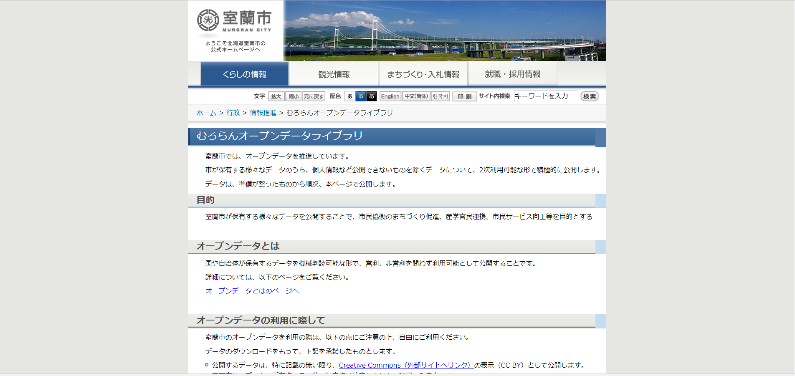
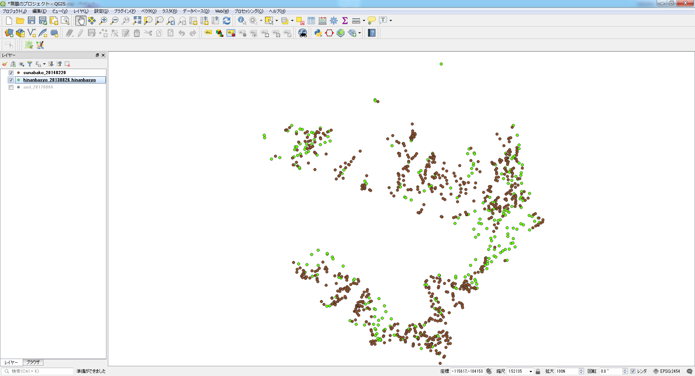
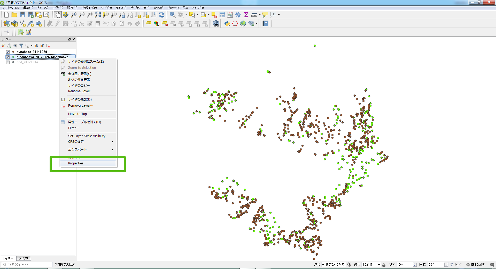
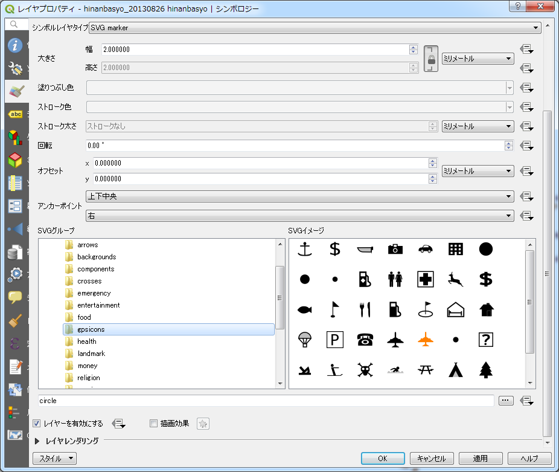

# Part IV：テーマを決めてデータを可視化する

　本Partでは、インターネット上で手に入るオープンデータから「防災地図」「人口分布図」「山岳地図」「カッパの出没地図」を作成していきます。はじめは、データに付いている属性でカテゴリ分けして表現をつけていくことから始めましょう。そのまま使えるデータもあれば、データによっては加工したほうが使いやすいものもあります。またさまざまなデータを組み合わせて定番の、もしくは自分なりの新たな解析を行い、解析結果を可視化することも可能です。
　データの組み合わせからさまざまな可視化を楽しんでみましょう。
　なお、本PartではオープンソースソフトウェアのGISツールである「QGIS」を使います。Appendix A「QGIS操作ガイド」（●●ページ）を参考にインストールしてください。
　本書ではQGIS3.2で説明していますが、以降のバージョンでもほぼ同じ操作となります。


第10章：防災／減災／安全に役立つ地図を作成する
第11章：年齢別人口分布図を作成する
第12章：山岳表現を作成する（国内編）
第13章：山岳表現を作成する（世界編）
第14章：カッパ出没マップを作成する

#第10章：防災／減災／安全に役立つ地図を作成する

### 編集メモ：リード文
　市区町村などからオープンデータで公開されている情報の代表的なものとして、避難所やAED設置場所といった防災／減災／安全分野に関わる情報があります。国土数値情報からも、災害／防災というくくりで、土砂災害危険箇所、浸水想定区域、避難施設などが公開されています。地理空間情報がもっとも力を発揮する分野です。

### 10.1：データをダウンロードする
　北海道室蘭市で提供するオープンデータを利用して、防災／減災に関する地図を作成してみましょう。
　該当データは図10-1から最新のものが提供されています。
　この章の前半で使用する、砂箱、避難所、AEDのデータは、それぞれをダウンロードし、展開した後にmuroran_dataとしてまとめました。
　後半で使用するデータは、都市計画現況図平成23年版　レイヤ別のShape（ZIP：107MB）になります。
ダウンロード後に展開すると、DM_H23_Layer_20131211というディレクトリになります。


- 図10-1：室蘭オープンデータライブラリ


- 室蘭オープンデータライブラリURL
```	
http://www.city.muroran.lg.jp/main/org2260/odlib.php
```

- 表10-1：防災／減災／安全に関する室蘭市オープンデータ一覧


- 図10-2：フォルダ構成
###<font color="red">TODO</font>

### 10.2：点要素のスタイル
　○○の設置場所、避難所といった点要素は、スタイルを定義してパッと見てわかるようにしておくのが一般的です。まず、ベクタデータを新規レイヤとして追加します。先ほど展開したデータの中から「sunabako.shp」を追加します（▼図10-3）。同様に「hinanbasyo.shp」を追加します（▼図10-4）。
　次に、レイヤパネルの「hinanbasyo」上で右クリック⇒［Properties］を開きます。[マーカー]⇒[Simple Layertype]⇒[シンボルレイヤタイプ]を選択すると［SVGグループ］が表示されます（▼図10-6）。▼図10-7のように［SVGグループ］⇒［gpsicons］⇒ SVGイメージ内の［cross.svg］をクリックして［OK］すると、アイコンのプロパティ変更が反映され、避難場所のアイコンが▼図10-8のようになります。

- 図10-3：砂箱ポイント


- 図10-4：避難場所ポイント


- 図10-5：レイヤプロパティ


- 図10-6：レイヤプロパティSVGグループ


- 図10-7：レイヤプロパティSVGグループ−gpsicons


- 図10-8：アイコン変更時


### 10.2.1：アイコンのユーザ定義
　続いて「aed_20170804.shp」を追加します。レイヤパネルのaed_20170804上で、右クリック⇒［レイヤのプロパティ］で［ユーザ定義SVG］（▼図10-9）を参照してください。
　▼図10-9の枠内に、次の文字列を入力して保存します。シンボルの名前は「aed」とします（▼図10-10）。

 ▼編集メモ：本文中リスト

```
https://upload.wikimedia.org/wikipedia/commons/4/43/ILCOR_AED_sign.svg
```

　追加した「aed」をアイコンを選択して［OK］すると、▼図10-11のようにAEDのアイコンが、ユーザ定義のものに変更されます。

- 図10-9：レイヤプロパティユーザ定義SVG


- 図10-10：AED SVG


- 図10-11：AED MAP


### 10.3：線要素のスタイル
　線要素のスタイルは、一般的には鉄道や道路、河川などが挙げられます。では、線要素のベクタデータを前項の点データと重ねてみます。DM_H23_Layer_20131211中から、下記のデータを次のデータを追加してください（▼図10-12）。

- 道路データ：DM_H23_douro_20131211.shp
- 鉄道データ：DM_H23_tetsudo_20131211.shp

　レイヤパネルのDM_H23_tetsudo_20131211上で右クリック⇒［レイヤプロパティ］で▼図10-13のように［topo railway］を選択してください。これで▼図10-14のように変更されます。

- 図10-12：道路と鉄道プロパティ変更前MAP


- 図10-13：鉄道ラインプロパティ定義


- 図10-14：道路と鉄道プロパティ変更後MAP

## 10.4：面要素のスタイル
　場所を指定する目標物はポイントですが、公園や建物そのものは本来ポリゴンで描かれます。また、災害の場合は、津波や洪水による、浸水地域などもポリゴンで描かれます。

### 10.4.1：土砂崩れデータ
　今回は土砂崩れに関するデータを使用して、土砂災害が起こった場合を想定してみます。次の2つのファイルをベクタデータとして追加してください（▼図10-15）。

- dosekiryu_20170913.shp
- dosekiryukiken_20170913.shp

- 図10-15：土砂崩れデータの追加


▼図10-15をもとにして土砂災害が起こった場合に、通行できなくなる可能性がある区間を算出して描画してみましょう。
メニューから［ベクタ］⇒［空間演算ツール］⇒［交差］▼注1を選択して、▼図10-16を表示します。入力ベクタと交差レイヤには重ね合わせたいレイヤを2つ選択します。
共通部分のくり抜いたレイヤは、新規のシェープファイルとして定義されるので、作成されるShapeファイルの保存先となるディレクトリを選択してください。
dosekiryu_20170913.shpとDM_H23_douro_20131211を交差し、新規に作成されたデータをdouro_dosekiryu.shpとして保存します。
また、同様にdosekiryukiken_20170913とDM_H23_douro_20131211を交差し、新規に作成されたデータをdouro_dosekiryukiken.shpとして保存します。
douro_dosekiryuとdouro_dosekiryukikenを和(ユニオン)で結合し、土砂災害の関連のある個所として扱える一つのファイルとします。結合したファイルはdouro_dosekiryu_union_kiken.shpとして保存しました。

この一連の作業で作成したdouro_dosekiryu_union_kiken.shpを新たに追加したのが▼図10-19になります。青太線部分の道路は、土石流の危険地域と重複する道路であることがわかります。

###### 注1
［交差］と［クリップ］は共に2つのレイヤの共通部分が新しいレイヤとして作成されますが、結果のジオメトリの保存内容が異なります。［交差］は交差する双方の属性値が保存され、［クリップ］は先に指定したレイヤの属性値だけが保持されます。  
  
- 交差ダイアグラム  


土砂災害警戒区域(土石流)と土石流危険区域の、それぞれと交差する道路部分は異なっていることが分かります。

- 図10-17：土砂災害警戒区域及び土石流危険区域


- 図10-18：和ダイアログ


- 図10-19：土石流被災道路


### 10.4.2：浸水深データ
　次に、浸水深のデータを読み込み、浸水深毎に色分けを行います。

　では、flood_20130826.shpを読み込んでください（ソースタイプのエンコーディングは「SJIS」を選択してください）。図10-20が表示されます。

- 図10-19：洪水浸水深さ


該当レイヤ上で右クリック⇒［Propaties］⇒[シンボロジー]の「Single Symbol」を「Categorized」に変更し、［カラム］は「浸水深さ」を選択してください。「Guraduated」を選択したいところですが、今回の場合、選択カラムの「浸水深さ」には●●m以上\~●●m未満という表記内容になっております。このため、数値列とは異なり、単純に階層化が出来なくなるため、選択できません。
［Categorized］をクリックすると、▼図10-21のように水深によって色分けされます（単一の指標を色相別に分解して表示する場合は、単一の色階調を選択してください）。
ここで、設定したデータは▼図10-21~23のようになります。

- 図10-21：レイヤプロパティ設定1
Categorizedを選択します。


- 図10-22：レイヤプロパティ設定2
カラムには浸水深さ、カラーランプはBlueを選択してください。


- 図10-23：レイヤプロパティ設定3
左下、「分類」をクリックしてください。この時、なぜかひとつ値のないカラーランプが表示されます。これは、図を参考にハイライトした状態で、マイナスをクリックして削除してください。


- 図10-24：レイヤプロパティ設定4

正しく分類出来たことを確認した後、「適用」⇒「OK」とクリックしてください。

- 図10-25：浸水深データの色階調分類表示

