### ArcGIS Onlineの紹介

既存のGISソフトウェアとして、有名なGISソフトウェアにArcGISがあります。
昨今のクラウドサーバー・サービスの流行など、時代の流れに合わせソフトウェアやライセンスの体系の大幅な変更がありました。
今回紹介するArcGIS Online等も、この点を意識した改正が多いです。
本書では、オープンデータにも焦点を当てていたが、取得のみならず、積極的に自身もデータを公開する側になることが可能となりました。それも難しいサーバーなどの設定や運用をせずに、情報を公開することが可能な時代になりつつあります。

もちろん、前述のTableau同様に、ArcOnlineも無料アカウントでは、本来のArcGISが持っている機能などと比べ、大きく制約を受けます。しかし、この点に関しては、本書の趣旨であるQGISが吸収できる部分も大きいです。ここでArcOnlineを紹介する理由は、編集したコンテンツをWEBサービスとして公開できる非常に有益なオープンデータのプラットフォームであるためです。


```
https://www.arcgis.com/home/index.html
```
上記リンクにアクセスしていただくと

下記の画面になります
- index画面
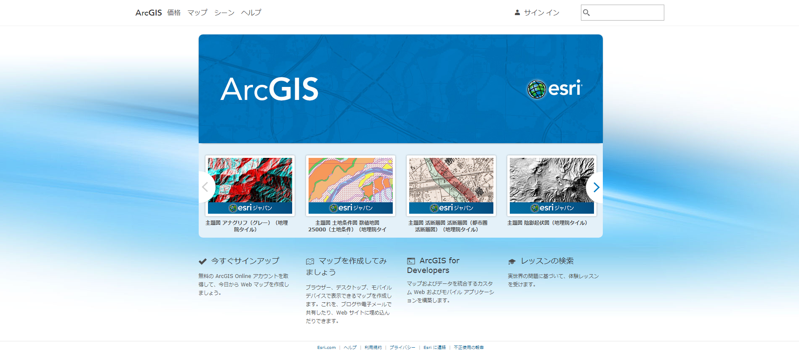

右上、サインインをクリックしてください。

- signin画面
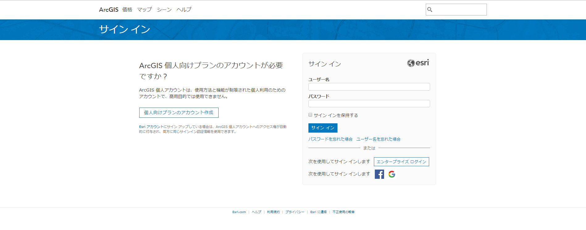

画面中断に、ログイン用の画面が出力されます。
左側、「個人向けのプランのアカウント作成」か、右側の「次を使用してサインインします」から、facebook、Googleのお好みの方のアカウントでログインすることも可能です。

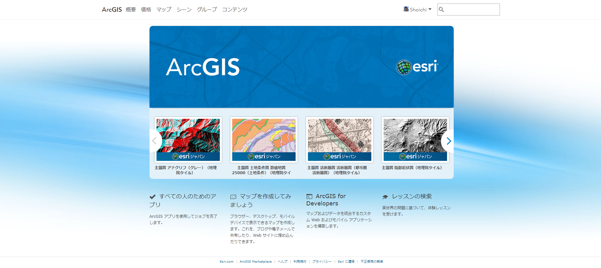

サインインが完了したら、左上のタブメニューから「マップ」を選択してください。

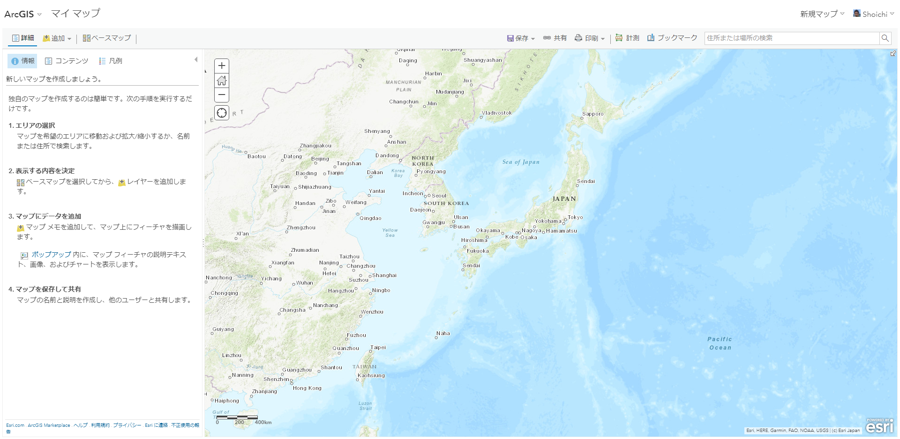

このように、左側にパネルがあり、地図が開かれるかと思います。
このサービスのメリットは、予めベースマップが複数用意されていることが挙げられます。
例えば、「ベースマップ」をクリックしてください。これは標準で7種類あります。

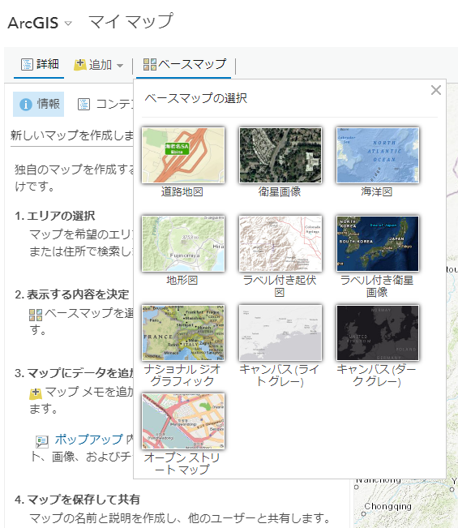

次に、「追加」をクリックしてください。Living Atlasなどもデータとセットで加工可能なデータセットとして扱えます。
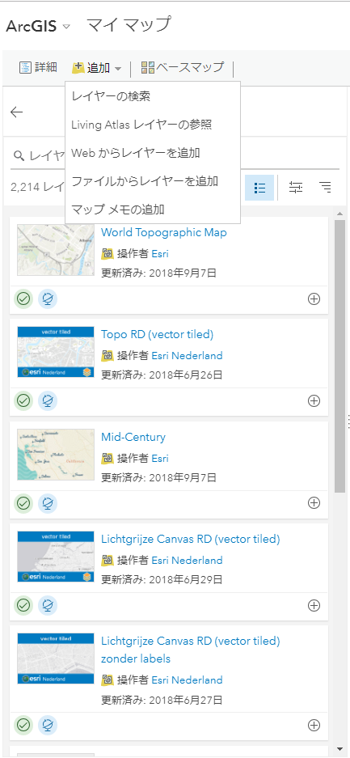

Living Atlasをプルダウンすると、ArcGIS Onlineが表示され、このデータセットも使用可能です。
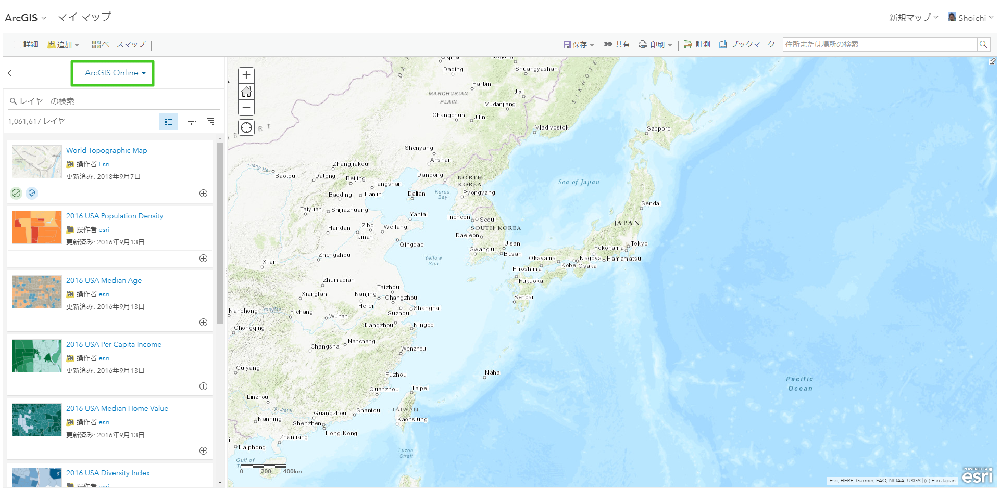

さて、これらのデータも非常に有用なものが多いのですが、今回は、防災マップの作り方の章で案内した、室蘭のデータを使用する例を紹介してみたいと思います。

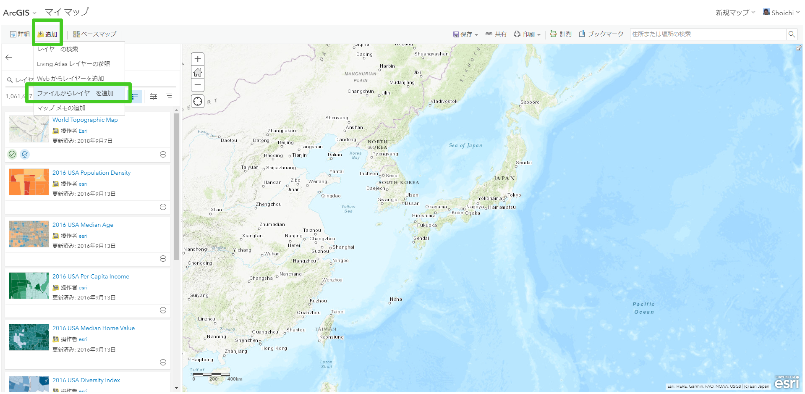
画面左上、「追加」をクックして下さい。
プルダウンメニューの中から、「ファイルからレイヤーを追加」を選択してください。

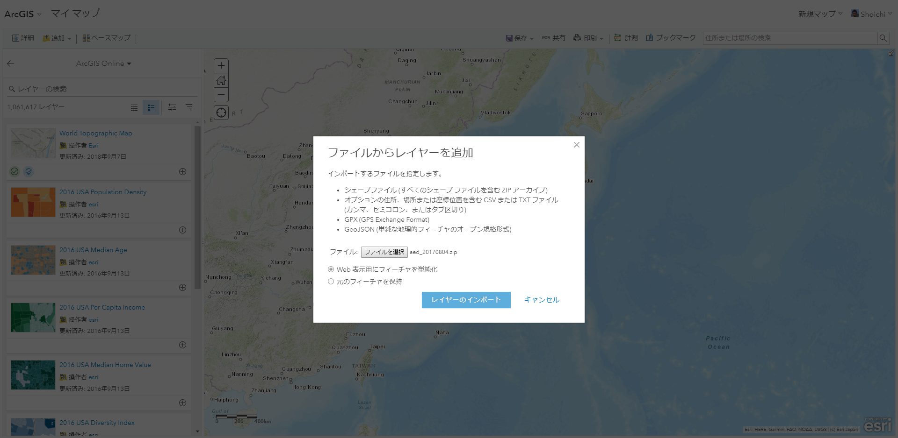
追加するファイルレイヤーを、尋ねられます。ここで、ダウンロード済みの
- aed20170804.zip
をアップロードしてください。この時、注意点としては、.shpだけではなく、.shxなど含む.zipを丸ごとアップロードしてください。

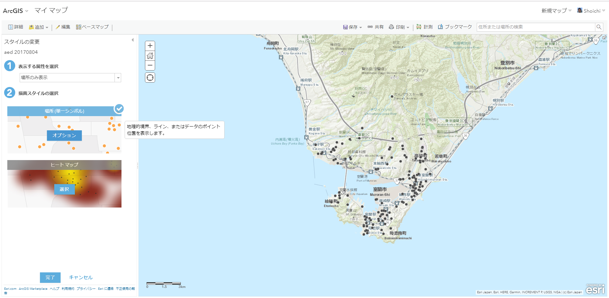
1.「表示する属性を選択する」に「場所のみを表示」を選択します。
2.「描画する方法を選択する」に、今回のデータが点のポリゴンであるため、表示方法にいくつかの候補が出力されています。
今回の場合は、「場所　単一シンボル」をクリックしてください。その後、オプションをクリックします。

オプションをクリックすると下図のような画面が開きます。
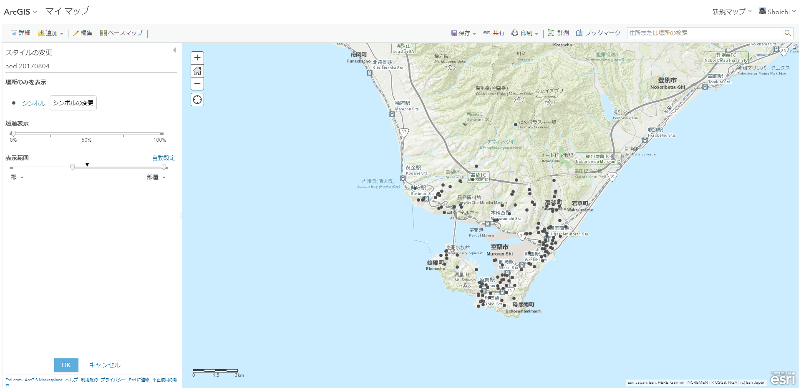

次に、「シンボルの変更」をクリックすると
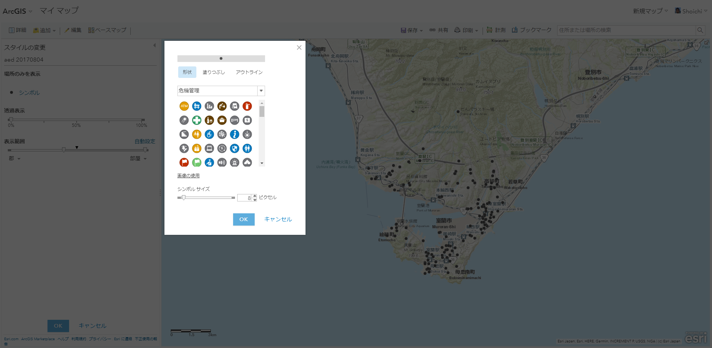
形状が選択可能になります。「形状」を危機管理にすると、左上に緑色の十字のマークがあります、これを選択してアクティブウィンドウ下の「OK」をクリックしてみましょう。

aedと同様の手順で、砂箱のzip(sunabako_20140220)もアップロードしてみましょう。
シンボルの変更の際に、今度は「形状」を災害にしましょう。すると、大きな雪の結晶のアイコンが表示されます。それをクリックして選択してください。
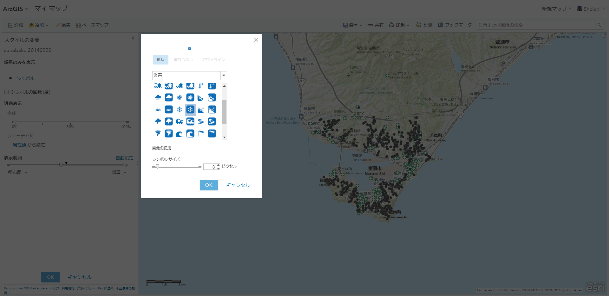

大分、それらしくなってきたかと思います。最後に、避難場所のデータも同様にアップロードしてみましょう。
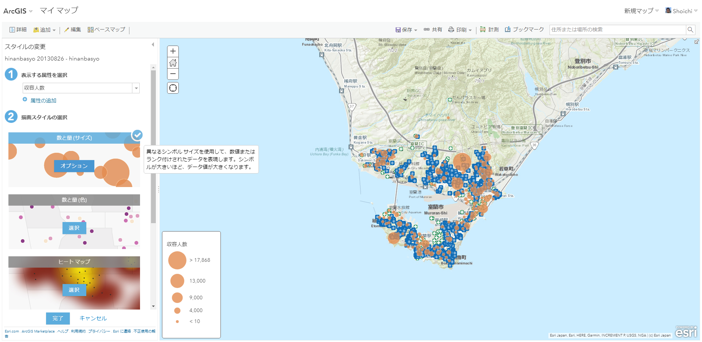
このデータに関しては、少々表示を変えてみましょう。

1.「表示する属性を選択する」に「収容人数」を選択します。
2.「描画する方法を選択する」に、今回のデータが点のポリゴンであるため、表示方法にいくつかの候補が出力されています。今回はここで「数と量(サイズ)」を選択します。
すると、その収容所が持つ収容人数の大きさに合わせて、自動で円のサイズを選択して描画します。

さらに、全てのデータをアップロードしたならば、凡例だけ表示した方が見やすいでしょう。
ペインの右上「凡例」を選択します。
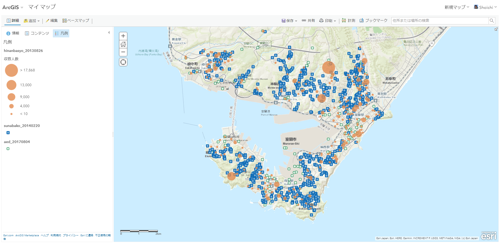

ここで、画面中央上部にある保存をクリックします。
「マップの保存」というアクティブウィンドウが出現します。ここにタイトルや、タグ、サマリーを記載します。記載が終わったら、マップの保存を行ってください。

保存完了後に、マップの埋め込み用のリンクが表示されます。
- see below
https://arcg.is/11zmaP

