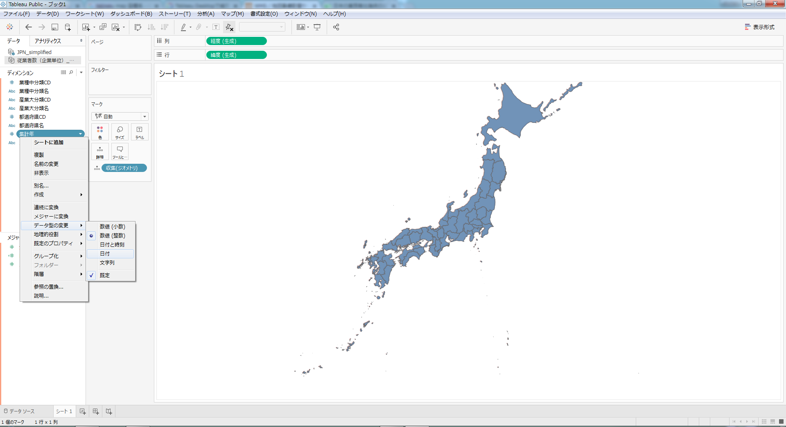

# Part V：CARTO,Tableau,ArcGIS

　本Partでは、QGISと連携することでさらに活用の可能性か広がるいくつかのツールを紹介します。


# Tableau

### Tbaleau Community

Tableauは、グラフやビジュアライゼーションに関する操作にかかる時間を大幅に削減してくれるツールです。ビジュアライゼーションの一環としての地図表示機能も備えており、地図そのものを編集するQGISと補完関係にあります。

- 図10-1：Tableau Community


Tbaleauには、コミュニティーフォーラムがあり、ユーザー間でのtip共有や質疑応答が行われている。今回は、ここから「簡略化された日本地図の表示について」という、質問の内容を事例として紹介します。
質問の内容から察するに、TableauでMAP表示を行う際に、日本だけ表示したい。また、表示は都道府県の粒度で良いということが前提になります。
その上で、この日本地図で都道府県ごとにグラフや色分けをしたいということが主題のようです。
そこでまず、簡素化した都道府県のポリゴンを作成します。

- 図10-2：QGIS 簡素化


初めに、都道府県の地図データを作成する必要があります。この時に、国土数値情報の公開する行政区域は精度の都合上、データ量が大きくなってしまいます。そこで、精度を多少下げることで、頂点数を削減し、データ量を軽くする機能がQGISにはあります。これを簡素化(Simplify)と呼びます。

- 図10-3：QGIS 簡素化 ダイアログ


入力レイヤ:都道府県地図(ポリゴン)
簡素化の方法:エリア(Visvalingam)
許容範囲:0.001000

として保存します。Tableauでは、shpやgeojsonやKMLなど主要な地図表示形式であれば読み込み可能です。
次に紹介するデータを読ませ、ここで作成した地図データと結合します。

- 図10-4：Tableau Public


Tableauには商用のものと、Publicエディションの両方が用意されており、幾ばくかの機能制約は受けるものの、publicエディションでも基本的な機能は使用可能です。今回は、本誌の趣旨であるオープンソースに即するために、Public エディションを使用します。オープンであることは、必ずしもフリーと等価ではありません。しかし、現段階ではTableau Publicの機能制約として、Public版はデータを保存する際に、Tableau Publicのサーバーにデータを保存することが必須になります。この時に、ダウンロードに関して制約を設けることは可能ですが、グラフ自体は公開されます。GitHubの無料アカウントと同様の制限だと思っていただければと思います。

- 図10-4a：Tableau Public


- 図10-4a：RESAS


ここではRESASで公開されている、雇用に関するデータを使用して、都道府県別に表示を行います。
▼URL▼ https://resas.go.jp
- 従業者数(企業単位)\_都道府県_業種別中分類.csv

次に、先ほど作成した、日本地図を読み込み、紐づけます。
「空間ファイル」をクリックします。

- 図10-4b：Tableau Public


読み込みを行ったら、「データ」からリレーションの選択をクリックし、下記のように設定します。
- 図10-4c：Tableau Public  


- 図10-4d：Tableau Public  


- プライマリデータソース:従業者数(企業単位)\_都道府県_業種別中分類
- セカンダリデータソース:JPN_simplified
- カスタムにチェックを入れます
- 追加をクリックします

- 図10-4e：Tableau Public  


リレーションを作成します。

- プライマリデータソースフィールド:都道府県名
- セカンダリデータソースフィールド:N03_001

- 図10-4f：Tableau Public  


>4g追加

画面左上、鎖マークでデータソースが連結されていることが確認できます。
- 図10-4h：Tableau Public  


次に、Tableauの標準マップではなく、農研機構の公開するWMS配信サーバーからデータを取得して、日本のみを表示します。

マップ⇒バックグラウンドマップ⇒マップサービスの順にクリックしてください。
マップサービスのURLには、下記URLを指定してください。

- 図10-5：Tableau Public  

```
http://www.finds.jp/ws/wms.php?
```
マップレイヤーから、FGD25000をチェックすします。

- 図10-6：Tableau Public


上図のように、日本地図が都道府県のみ表示されるかと思います。

次に、Tableauではディメンションとメジャーと言う概念を内包していますが、今回のデータの場合は、産業大分類CD・産業中分類CD・都道府県CDはディメンションになりますので、ドラグしてメジャーからディメンションへ変更してください。また、集計年も同様に、ディメンションになりますが、これは型の変換も行う必要があります。
そのカラム上で右クリックを行い、データ型の変更⇒日付を選択してください。

- 図10-7：Tableau Public


メジャーから「企業単位_従業者数(人)」を選択し、ドラグしてマークペインの「色」の上にドロップしてください。
次に、フィルターを設定します。
例えば、この調査は、2009,2012,2014年にそれぞれ行われたものですので、「年」をフィルターにします。
また、産業分類毎に従事する人の数を記載されたデータですので、「産業大分類名」をフィルターにします。

- 図10-8：Tableau Public


これで、地図上に表示することが出来ました。もちろんこれは、第11章で既に紹介したコロプレス図と同じことになります。
Tableauであれば、これにグラフを作成することができます。

- 列:「企業単位_従業者数(人)」
- 行:「都道府県名」

を設定します。
フィルターに関しては、マップと同様に「年」と「産業大分類」にしてあります。

- 図10-9：Tableau Public


これは、例えば、マップでは、ほぼ同じ色になってしまって差が分かり難いものがあり、グラフで見比べたいことなどがあります。
地図は地図として、グラフはグラフとしてそれぞれに異なる意味のあるもので、一長一短があります。
また、この画像では都道府県を国土交通省の公開する「都道府県コード」の順に従って並べ替えを行っております。
都道府県コード　　〈 ファイル名称：PrefCode 〉
http://nlftp.mlit.go.jp/ksj/gml/codelist/PrefCd.html
