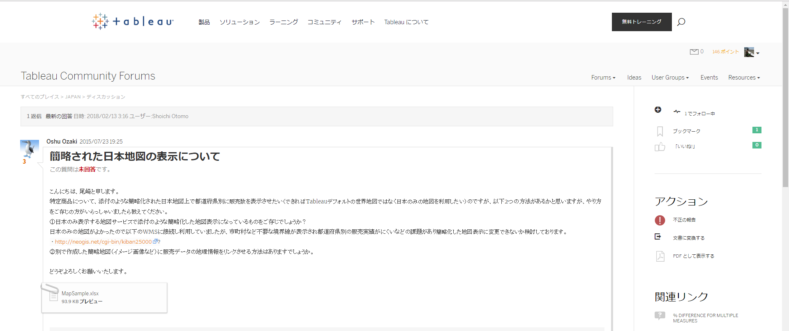
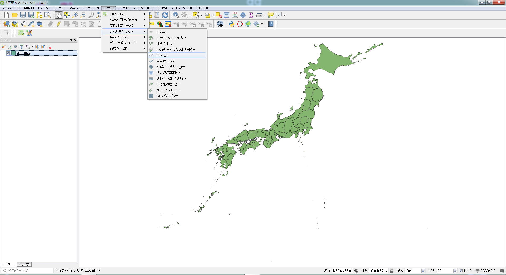
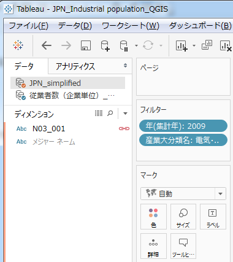

# Part V：CARTO,Tableau,ArcGIS

　本Partでは、QGISと連携することでさらに活用の可能性か広がるいくつかのツールを紹介します。


# Tableau

### Tbaleau Community

Tableauは、グラフやビジュアライゼーションに関する操作にかかる時間を大幅に削減してくれるツールであると筆者は考えている。ビジュアライゼーションとしての地図表示機能も備えており、地図そのものを編集するQGISと補完関係にあるといえるであろう。

- 図10-1：Tableau Community


Tbaleauには、コミュニティーフォーラムがあり、ユーザー間でのtip共有や質疑応答が行われている。今回は、ここから「簡略化された日本地図の表示について」という、質問の内容を事例として紹介したい。
質問の内容から察するに、TableauでMAP表示を行う際に、日本だけ表示したい。また、表示は都道府県の粒度で良いということが前提になる。
その上で、この日本地図で都道府県ごとにグラフや色分けをしたいということが主題のようである。
そこでまず、簡素化した都道府県のポリゴンを作成する。

- 図10-2：QGIS 簡素化


初めに、都道府県の地図データを作成する必要がある。この時に、国土数値情報の公開する行政区域は精度の都合上、データ量が大きくなってしまう。そこで、精度を多少下げることで、頂点数を削減し、データ量を軽くする機能がQGISにはある。これを簡素化(Simplify)と呼ぶ。

- 図10-3：QGIS 簡素化 ダイアログ


入力レイヤ:都道府県地図(ポリゴン)
簡素化の方法:エリア(Visvalingam)
許容範囲:0.001000

として保存する。Tableauでは、shpやgeojsonやKMLなど主要な地図表示形式であれば読み込み可能である。
次に紹介するデータを読ませ、ここで作成した地図データと結合する。

- 図10-4：Tableau Public


Tableauには商用のものと、Publicエディションの両方が用意されており、幾ばくかの機能制約は受けるが、publicエディションでも基本的な機能は使用可能である。今回は、本誌の趣旨であるオープンソースに即するために、Public エディションを使用する。

- 図10-4a：Tableau Public


- 図10-4a：RESAS


ここではRESASで公開されている、雇用に関するデータを使用して、都道府県別に表示を行う。
▼URL▼ https://resas.go.jp
- 従業者数(企業単位)\_都道府県_業種別中分類.csv

次に、先ほど作成した、日本地図を読み込み、紐づける。
「空間ファイル」をクリックする。

- 図10-4b：Tableau Public


読み込んだら、「データ」からリレーションの選択をクリックし、下記のように設定する。
- 図10-4c：Tableau Public  


- 図10-4d：Tableau Public  


- プライマリデータソース:従業者数(企業単位)\_都道府県_業種別中分類
- セカンダリデータソース:JPN_simplified
- カスタムにチェックを入れる
- 追加をクリックする

- 図10-4e：Tableau Public  


リレーションを作成する。

- プライマリデータソースフィールド:都道府県名
- セカンダリデータソースフィールド:N03_001

- 図10-4f：Tableau Public  


>4g追加

画面左上、鎖マークでデータソースが連結されていることが確認できる。
- 図10-4h：Tableau Public  


次に、Tableauの標準マップではなく、農研機構の公開するWMS配信サーバーからデータを取得して、日本のみを表示する。

マップ⇒バックグラウンドマップ⇒マップサービスの順にクリックしてください。
マップサービスのURLには、下記URLを指定してください。

- 図10-5：Tableau Public  

```
http://www.finds.jp/ws/wms.php?
```
マップレイヤーから、FGD25000をチェックする。

- 図10-6：Tableau Public


上図のように、日本地図が都道府県のみ表示されるかと思います。
